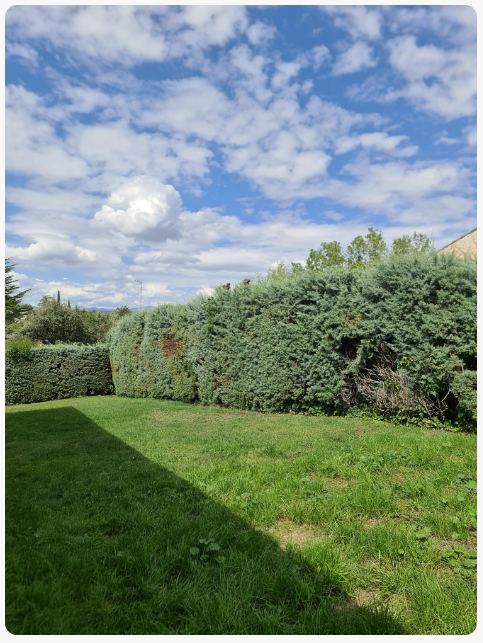

[](https://github.com/hacs/integration)

# Lovelace Media Source Image Card
A Lovelace custom card for showing images stored in Media Source and, optionally, toggle an entity when clicked.

## Description
The cards included in Home Assistant Lovelace for showing images only allow you to show images that are publicly accessible (i.e: url of an image from the internet). This is a privacy concern to me as I want to show pictures of my house and garden and even members of my family.

This cards allows you to store your images in a the media source module of Home Assistant and show them in Lovelace dashboards without having to make them public.

It can also toggle an entity if provided in configuration, like a light, switch, etc.

## Installation

### Manual Instalation

1. Download the [media-source-image-card](http://www.github.com/luixal/lovelace-media-source-image-card/releases/latest/download/media-source-image-card.js)
2. Place the file in your `config/www` folder
3. Include the card as a resource through the UI (panels page) or using some code like this:

  ```yaml
  title: Home
  resources:
    - url: /local/button-card.js
      type: module
  ```

4. If not already there, upload an image going to the Media Browser page in Home Assistant, inside the _"My media"_ folder.
5. Include the card code dashboard by selecting the card type itself or just a manual card:

  ```yaml
    type: custom:media-source-image-card
    image: media-source://media_source/local/my_image.jpg # put your image name here
    entity_id: switch.my_light_switch  # this entity is optional
  ```

### Using HACS
This card is available as a HACS custom repository, you can follow [HACS guide for custom repos](https://hacs.xyz/docs/faq/custom_repositories/), basically these are the steps to follow:

1. Go to the frontend section in your Home Assistant's HACS page.
2. Click on the 3 dots in the top right corner.
3. Select "Custom repositories"
4. Add the URL of this repo.
5. Select the correct category.
6. Click the "ADD" button.

## Configuration
This card is quite simple so there are only a few options:

| Name | Type | Default | Description |
| ---- | ---- | ------- | ----------- |
| type | string | `custom:media-source-image-card` | **REQUIRED** |
| image | string | | **REQUIRED** The path to the image in media source format. i.e: media-source://media_source/local/my_image.jpg |
| aspect_ratio | number | '1.9' | Image aspect ratio |
| object_fit | string | 'contain' | The CSS object-fit property for resizing and fitting the image. Possible values are: `cover`, `contain`, `fill`, etc. |
| entity_id | string | | The entity you want to toggle when card is clicked |
| apply_grayscale | boolean | | If `true` applies a grayscale on the image when entity is `off` |
| forced_refresh_interval | integer | | Number of seconds to force an image refresh |
| tap_action | string | `toggle` | Action to perform on click. One of `none`, `toggle` or `call-service`. See actions below |

## Actions
By default, when the card is clicked, it would toggle the entity. You can customize these action to be one of this:

- `none`: nothing happens
- `toggle`: the entity is toggled (default behaviour)
- `call-service`: a service is called with a custom configuration

### Call Service
This is a simple call service example:

```yaml
type: custom:media-source-image-card
image: media-source://media_source/local/banana.png
entity_id: input_boolean.boolean_test
apply_grayscale: true
tap_action:
  action: call-service
  service: input_boolean.turn_on
  target:
    entity_id: input_boolean.boolean_test
```

If no `target` is provided, the `entity_id` field is used.

### Templating
You can use templates in the `image` field. In fact, you can use jinja2 and javascript templates.

The main difference is that jinja templates are rendered in the server and tend to hit perfomance overall while javascript templates run locally in the browser and need no additional messaging with the server.

Personally, I prefer javascript templates :)

#### Jinja2 Templates
You can use jinja templates like this:

```yaml
type: custom:media-source-image-card
image: |
  media-source://media_source/local/{{ states('input_text.image') }}
entity_id: input_boolean.boolean_test
apply_grayscale: true
tap_action:
  action: call-service
  service: input_boolean.turn_on
  target:
    entity_id: input_boolean.boolean_test
```

#### Javascript Templates
You can also provide a javascript template like this:

```yaml
type: custom:media-source-image-card
image: |
  [[[
    return `media-source://media_source/local/${ hass.states['input_text.texting'].state }`;
  ]]]
entity_id: input_boolean.boolean_test
apply_grayscale: true
tap_action:
  action: call-service
  service: input_boolean.turn_on
  target:
    entity_id: input_boolean.boolean_test
```

You need to enclose your function between triple brackets ('[[[' and ']]]'). The variables available in the function are:

| Variable | Description |
| -------- | ----------- |
| hass | The whole hass object where you can access everything |
| states | The states object inside `hass` |
| user | The object with information about the logged user |
| config | The card config itself |


## Examples

### Simple Image
This example only shows an image:

```yaml
  type: custom:media-source-image-card
  image: media-source://media_source/local/20230919_145924.jpg
```



### Image with switch control
Shows and image. When clicked and toggles a switch on/off:

```yaml
type: custom:media-source-image-card
image: media-source://media_source/local/20230919_145924.jpg
entity_id: switch.light_switch
```

### Image with switch control applying grayscale
Shows and image. When clicked, toggles a switch on/off and applies grayscale when it's off:

```yaml
type: custom:media-source-image-card
image: media-source://media_source/local/20230919_145924.jpg
entity_id: switch.light_switch
apply_grayscale: true
```

 

### Image with switching a boolean input helper using a service call

```yaml
type: custom:media-source-image-card
image: media-source://media_source/local/banana.png
entity_id: input_boolean.boolean_test
apply_grayscale: true
tap_action:
  action: call-service
  service: input_boolean.turn_on
  target:
    entity_id: input_boolean.boolean_test
```

### Random image using just a template
This will refresh the image every 10 seconds, resolving the template again and showing a random image in a `X.png` format, where `X` is a number.

```yaml
type: custom:media-source-image-card
image: |
  media-source://media_source/local/{{ '%02d' % range(1, 20) | random }}.png
entity_id: input_boolean.boolean_test
apply_grayscale: true
forced_refresh_interval: 10
tap_action:
  action: call-service
  service: input_boolean.turn_on
  target:
    entity_id: input_boolean.boolean_test
```
